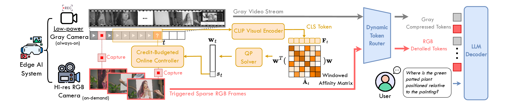

# ColorTrigger (CVPR 2026)

[**Color When It Counts: Grayscale-Guided Online Triggering for Always-On Streaming Video Sensing**](https://arxiv.org/abs/2603.22466)

Weitong Cai, Hang Zhang, Yukai Huang, Shitong Sun, Jiankang Deng, Songcen Xu, Jifei Song, Zhensong Zhang

    

